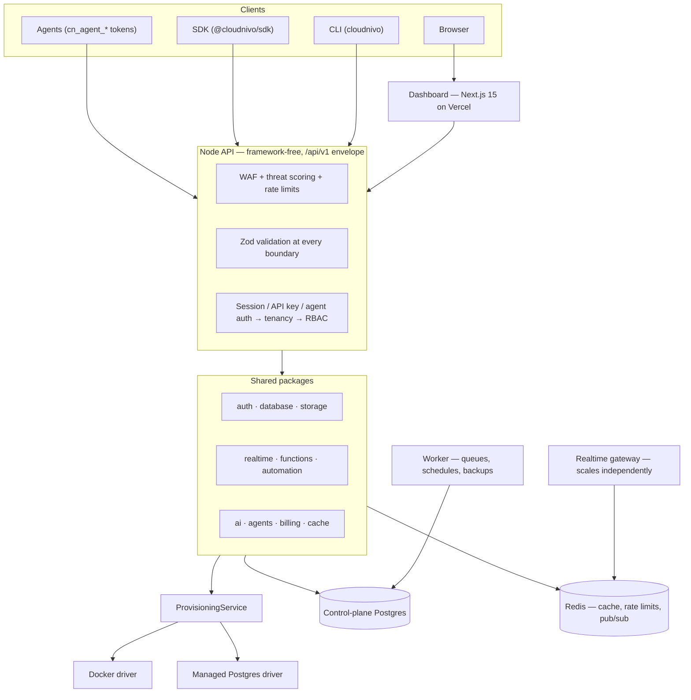
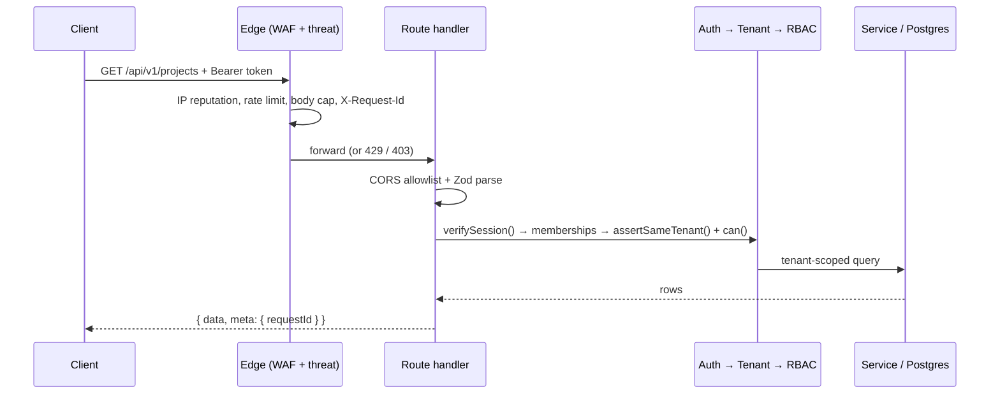

<div align="center">


### The backend primitives of a BaaS, on infrastructure you control.

<p>
  
  
  
  
  
  
</p>

<p>
  
  
  
  
  
</p>

<p>
  <a href="https://github.com/japhethsunday/cloudnivo.com/stargazers"></a>
  <a href="https://github.com/japhethsunday/cloudnivo.com/network/members"></a>
  <a href="https://github.com/japhethsunday/cloudnivo.com/issues"></a>
  <a href="https://github.com/japhethsunday/cloudnivo.com/commits"></a>
  
  
</p>

<p>
  <a href="#-quick-start"><b>Quick start</b></a> ·
  <a href="#-features"><b>Features</b></a> ·
  <a href="#-architecture"><b>Architecture</b></a> ·
  <a href="#-apisdk-usage"><b>API &amp; SDK</b></a> ·
  <a href="#-self-hosting--deployment"><b>Deploy</b></a> ·
  <a href="#-security"><b>Security</b></a> ·
  <a href="#-documentation"><b>Docs</b></a>
</p>

</div>

---

## 👋 What is CloudNivo?

**CloudNivo is a developer-focused Backend-as-a-Service control plane.** It gives you
the primitives you'd reach for in Supabase or Firebase — a real PostgreSQL database,
authentication, object storage, serverless functions, realtime channels, automations
and an AI backend builder — behind one console and one versioned REST envelope.

The difference is where that backend runs. CloudNivo provisions infrastructure through
a **swappable provisioning driver** rather than a single vendor's cloud. The same
developer experience targets a local Docker engine, a managed PostgreSQL cluster you
own, or a VPS — without changing a route, a schema or an SDK call.

It is a monorepo you can read end to end: a Next.js 15 dashboard, a framework-free Node
API, a standalone realtime gateway, a background worker, and 19 shared packages that
every surface builds on. No second engine hides behind the UI — the dashboard, the CLI
and the SDK are all thin clients over the same `/api/v1` routes.

> **Status.** CloudNivo is an actively developed platform with a live deployment at
> `cloudnivo.org`. It has no published customers, benchmarks or case studies, and this
> README does not claim any. Everything below is backed by code in this repository.

---

## 💡 Value proposition

|                      | What most BaaS platforms give you                | What CloudNivo gives you                                                                   |
| -------------------- | ------------------------------------------------ | ------------------------------------------------------------------------------------------ |
| **Infrastructure**   | One vendor's cloud, one region, one bill         | A `DatabaseProvisioner` interface — Docker, managed Postgres, or your own host             |
| **Lock-in**          | Proprietary APIs you rewrite to leave            | Plain PostgreSQL, plain REST, MIT-licensed source you can run yourself                     |
| **Agents**           | An AI feature bolted onto the side               | Scoped agent tokens, approval-gated destructive ops, and an audited plan → apply pipeline  |
| **Cost to start**    | A credit card                                    | `docker compose up -d` — Postgres and Redis locally, $0                                    |
| **Honesty of state** | Optimistic UI that lies when the backend is down | Every meaningful read is a live network read; the console degrades visibly, never silently |

**Three commitments the code enforces, not just the docs:**

1. **Agent-native.** `cn_agent_*` tokens carry explicit scopes; destructive operations
   require a recorded human approval before they run ([`docs/agent-tokens.md`](docs/agent-tokens.md)).
2. **Own your infrastructure.** Provisioning, storage, cache and realtime each sit behind
   an interface with more than one live driver. Nothing is coupled to one host.
3. **Fail closed.** Production refuses to boot on a placeholder `JWT_SECRET`, a reused
   `VAULT_KEY`, or a test-double provisioner ([`apps/api/src/prod-guards.ts`](apps/api/src/prod-guards.ts)).

---

## ✨ Features

<table>
<tr><td width="50%" valign="top">

### 🗄️ Database

Per-project PostgreSQL, provisioned on demand with a locked-down role. Schema
browser, SQL console, migrations, branches, diffing, advisors, CSV import/export,
encrypted credential vault and scheduled backups.
<br/>→ [`docs/database.md`](docs/database.md)

</td><td width="50%" valign="top">

### 🔐 Authentication

Two planes. **Platform**: signup, login, TOTP MFA, password reset, session
revocation, org invites, SSO/OIDC. **Customer**: each project gets its own end-user
auth with rotating refresh tokens, verify/reset email, and owner-scoped rows.
<br/>→ [`docs/authentication.md`](docs/authentication.md)

</td></tr>
<tr><td width="50%" valign="top">

### 🧩 Auto-generated REST

Introspection-driven CRUD for every table: `GET/POST /:table`,
`GET/PATCH/DELETE /:table/:id` with filtering, sorting and pagination — plus
per-project API keys and a live `openapi.json`.
<br/>→ [`docs/api.md`](docs/api.md)

</td><td width="50%" valign="top">

### 📦 Storage

Buckets, objects, signed URLs and quotas. Streaming local-filesystem driver for
development, SigV4 S3 driver for production, one interface for both.
<br/>→ [`docs/storage.md`](docs/storage.md)

</td></tr>
<tr><td width="50%" valign="top">

### ⚡ Realtime

WebSocket gateway with Postgres CDC (`LISTEN`/`NOTIFY`), broadcast and presence
channels. Memory bus for a single node, Redis pub/sub to scale the gateway out as
its own service.
<br/>→ [`docs/realtime.md`](docs/realtime.md)

</td><td width="50%" valign="top">

### 🛠️ Functions

Deploy, version, invoke, and read logs and env for serverless handlers. Two runtimes:
`vm`-based worker isolates, or Docker containers where an engine is available.
<br/>→ [`docs/functions.md`](docs/functions.md)

</td></tr>
<tr><td width="50%" valign="top">

### 🤖 AI backend builder

Describe a backend in prose; get a **structured plan** that is validated, diffed and
explicitly approved before anything is applied — with rollback on failure. The model
never executes; it only proposes plan data.
<br/>→ [`docs/ai-builder.md`](docs/ai-builder.md) · [`docs/ai-security.md`](docs/ai-security.md)

</td><td width="50%" valign="top">

### 🔁 Automation

Queues (publish/consume/ack/purge), cron schedules, and outbound webhooks with
signing, delivery history, replay and secret rotation.
<br/>→ [`docs/automation.md`](docs/automation.md)

</td></tr>
<tr><td width="50%" valign="top">

### 🪪 Agent access tokens

`cn_agent_*` tokens with scopes, IP restrictions, activity trails, and an approval
gate that destructive operations cannot bypass. Available in the dashboard, CLI and SDK.
<br/>→ [`docs/agent-tokens.md`](docs/agent-tokens.md)

</td><td width="50%" valign="top">

### 💳 Billing &amp; usage

Plans, quotas, budgets, usage metering and provider webhooks. The default provider is
manual and charges nothing — there is no payment processor wired in.
<br/>→ [`docs/roadmap.md`](docs/roadmap.md)

</td></tr>
<tr><td width="50%" valign="top">

### 🛡️ Edge defence

A WAF with adaptive IP reputation, per-IP/per-key/per-project rate limits, SSRF
guards on outbound drains, body caps, and a written incident procedure.
<br/>→ [`docs/ddos-response.md`](docs/ddos-response.md) · [`docs/security-center.md`](docs/security-center.md)

</td><td width="50%" valign="top">

### 📊 Operator console

~33 pages: projects and 18 per-project sections, plus organizations, agents, billing,
security, developer and account. Dark-first design system, WCAG 2.2 AA as the working
target.
<br/>→ [`docs/operations.md`](docs/operations.md)

</td></tr>
</table>

---

## 🏗 Architecture



**Tenancy is the spine:** `User → Organization → Project → Environment → Infrastructure`.
Memberships are the only grant. `assertSameTenant()` and `can(role, permission)` run
server-side on every request — client-supplied IDs and roles are never trusted.

**Request lifecycle:**



Every response — success or failure, in either runtime — uses the same envelope.
Full decision log: [`docs/architecture.md`](docs/architecture.md).

---

## 🧰 Tech stack

<div align="center">

</div>

| Layer          | Choice                                                                     |
| -------------- | -------------------------------------------------------------------------- |
| Dashboard      | Next.js 15.5 (App Router), React, TypeScript, CSS design tokens            |
| API            | Framework-free Node 20+ HTTP server, TypeScript, strict mode               |
| Realtime       | `ws` gateway, PostgreSQL `LISTEN`/`NOTIFY` CDC, Redis pub/sub              |
| Database       | PostgreSQL 16, Drizzle ORM, `postgres` driver, SQL migrations              |
| Cache / limits | Redis 7 (`ioredis`), in-memory driver for local development                |
| Validation     | Zod at every boundary — one schema set shared by both runtimes             |
| Auth           | scrypt password hashing, JWT sessions, TOTP MFA, hashed API keys, OIDC     |
| Tests          | Vitest (unit + integration), Playwright (e2e), an 18-step production smoke |
| Tooling        | ESLint 9 flat config, Prettier, npm workspaces, Docker Compose             |
| CI/CD          | GitHub Actions → Vercel (dashboard) + Railway (API, realtime, worker)      |

---

## 🚀 Quick start

**Prerequisites:** Node ≥ 20, npm ≥ 10, and Docker (for local Postgres + Redis).

```bash
git clone https://github.com/japhethsunday/cloudnivo.com.git
cd cloudnivo.com

cp .env.example .env          # then set JWT_SECRET (32+ chars) and VAULT_KEY
npm install
docker compose up -d          # Postgres 16 + Redis 7

npm run build:packages        # once — apps import built workspace output
npm run db:migrate            # apply control-plane migrations

npm run dev:api               # API      → http://localhost:3001
npm run dev                   # dashboard → http://localhost:3000
```

Confirm the API is alive:

```bash
curl http://localhost:3001/api/v1/health
# { "data": { "status": "ok", "version": "0.1.0" }, "meta": { "requestId": "…" } }
```

Then open <http://localhost:3000>, create an account, and create your first project.
With Docker reachable, CloudNivo provisions a real PostgreSQL database for it.

<details>
<summary><b>Other ways to run it</b></summary>

```bash
# Containerized API too (mounts the Docker socket — local development only)
docker compose --profile api up -d --build

# Realtime gateway as its own process
npm run dev:realtime
```

Windows PowerShell: use `Copy-Item .env.example .env` if `cp` is unavailable.

</details>

---

## ⚙️ Environment setup

All configuration flows through `loadConfig()` in [`packages/config`](packages/config/src/index.ts),
which parses **125 environment variables** with Zod and **fails fast** with a `ConfigError`
rather than booting half-configured. Four annotated templates ship with the repo:

| File                      | Use                                       |
| ------------------------- | ----------------------------------------- |
| `.env.example`            | Local development — sensible defaults     |
| `.env.local.example`      | Local overrides                           |
| `.env.staging.example`    | Staging                                   |
| `.env.production.example` | Production, with every hardening flag set |

**The minimum to boot:**

```bash
DATABASE_URL=postgres://cloudnivo:…@localhost:5432/cloudnivo
JWT_SECRET=          # 32+ chars, random, unique per environment
VAULT_KEY=           # 32+ chars, random, MUST differ from JWT_SECRET
CORS_ORIGINS=http://localhost:3000
```

Generate secrets with:

```bash
node -e "console.log(require('crypto').randomBytes(48).toString('base64'))"
```

**Production refuses to boot** if `JWT_SECRET` or `VAULT_KEY` is a documentation
placeholder, if `VAULT_KEY` equals `JWT_SECRET`, if `PROVISION_DRIVER=fake`, or if
`DATABASE_URL` still carries the docker-compose development password. It warns loudly
about `CONTROL_STORE=memory`, a localhost `REDIS_URL`, and development CORS origins.

> ⚠️ `NEXT_PUBLIC_API_URL` is inlined at **build** time and also builds the dashboard's
> CSP `connect-src` (both the `https://` and `wss://` origins). Changing it requires a
> rebuild, not a variable edit.

Never commit `.env`, `*.key` or `*.pem` — `.gitignore` already blocks them.

---

## 🔌 API/SDK usage

### REST

Base path `/api/v1`, identical in both runtimes. Three credential types:
a session **Bearer** JWT, a project **`apikey`**, or a **customer** JWT.

```bash
# Health
curl http://localhost:3001/api/v1/health

# Control plane — session token
curl -H "Authorization: Bearer $CLOUDNIVO_TOKEN" \
  http://localhost:3001/api/v1/projects

# Data plane — auto-generated per-table REST with a project key
curl -H "apikey: cn_…" \
  "http://localhost:3001/api/v1/projects/$PROJECT_ID/users?limit=20&order=created_at.desc"

# Insert a row
curl -X POST -H "apikey: cn_…" -H "Content-Type: application/json" \
  -d '{"email":"ada@example.com"}' \
  "http://localhost:3001/api/v1/projects/$PROJECT_ID/users"
```

Every response carries the same envelope:

```json
{ "data": { "…": "…" }, "meta": { "requestId": "0f2c…" } }
```

<details>
<summary><b>Error catalog</b></summary>

| Code                               | Status | When                                             |
| ---------------------------------- | ------ | ------------------------------------------------ |
| `VALIDATION_ERROR` / `BAD_REQUEST` | 400    | Zod body/query failure, with field-level details |
| `MALFORMED_JSON`                   | 400    | Body is not valid JSON                           |
| `UNAUTHORIZED` / `INVALID_KEY`     | 401    | Missing, invalid or expired session or key       |
| `FORBIDDEN` / `TENANT_FORBIDDEN`   | 403    | Cross-tenant access, wrong role, revoked key     |
| `NOT_FOUND`                        | 404    | Unknown route, table, row or job                 |
| `CONFLICT`                         | 409    | Slug or unique collision                         |
| `PAYLOAD_TOO_LARGE`                | 413    | Body over the configured cap                     |
| `RATE_LIMITED`                     | 429    | IP, per-key or per-project budget exceeded       |
| `PROVISION_FAILED`                 | 502    | Infrastructure operation failed (detail logged)  |
| `INFRA_UNAVAILABLE`                | 503    | Provisioner unreachable — retry later            |
| `INTERNAL`                         | 500    | Message redacted; `requestId` preserved          |

</details>

### TypeScript SDK

```ts
import { CloudNivoClient } from '@cloudnivo/sdk';

const cn = new CloudNivoClient({
  baseUrl: process.env.CLOUDNIVO_API_URL!,
  token: process.env.CLOUDNIVO_TOKEN!, // session JWT or cn_agent_* token
});

// AI builder: plan → approve → apply (the model never executes)
const plan = await cn.aiPlan(projectId, 'I need tasks with email reminders.');
await cn.aiApprove(projectId, plan.id);
await cn.aiApply(projectId, plan.id);

// Automation
await cn.createQueue(projectId, { name: 'jobs' });
await cn.createSchedule(projectId, { name: 'nightly', functionSlug: 'report', cron: '0 2 * * *' });
await cn.createWebhook(projectId, { name: 'ops', url, eventTypes: ['job.failed'] });
```

Errors surface as `SdkError` with a stable `code` and `status`.

> 🔒 The SDK is for servers, workers and CLIs. **Never bundle a session token or service
> key into browser code** — browsers go through the dashboard backend or short-lived
> customer tokens.

### CLI

```bash
npm run build --workspace=packages/cli
export CLOUDNIVO_API_URL=http://localhost:3001 CLOUDNIVO_TOKEN=…

npx cloudnivo ai plan     --project <id> --prompt "I need tasks."
npx cloudnivo ai approve  --project <id> --plan <planId>
npx cloudnivo queues list --project <id>
npx cloudnivo metrics     --org <orgId> --project <id> --window 24h
```

The CLI is a thin client over the same routes — approval and destructive-confirmation
rules match the dashboard exactly. Full reference: [`docs/sdk.md`](docs/sdk.md) · [`docs/cli.md`](docs/cli.md).

---

## 🚢 Self-hosting &amp; deployment

CloudNivo is provider-independent by design. Three supported shapes:

<details open>
<summary><b>Option A — Managed (Vercel + Railway)</b> · the production topology</summary>

- **Dashboard → Vercel.** Set `NEXT_PUBLIC_API_URL` to your API domain (build-time).
- **API → Railway** from `Dockerfile.api`. Health check `GET /api/v1/health/ready`,
  so degraded instances stop receiving traffic (see `railway.json`).
- **Realtime → Railway**, same image with `REALTIME_STANDALONE=true` and
  `REALTIME_DRIVER=redis`, sharing Redis with the API.
- **Worker → Railway** from `Dockerfile.worker` for queues, schedules and backups.
- **Data:** managed PostgreSQL + Redis, both private (no public TCP proxy).
- Use `PROVISION_DRIVER=managed` with `MANAGED_PG_URL` — one database and a
  locked-down role per project, no Docker daemon needed.

</details>

<details>
<summary><b>Option B — Docker Compose (VPS or local)</b></summary>

```bash
cp .env.example .env
docker compose up -d                          # postgres + redis
docker compose --profile api up -d --build    # + containerized API
```

`docker-compose.prod.yml` is the hardened variant. The API service mounts the Docker
socket so it can provision project databases — a deliberate local tradeoff, **not**
something to do on shared infrastructure.

</details>

<details>
<summary><b>Option C — Host-run API + local Docker engine</b> · recommended for development</summary>

```bash
docker compose up -d
npm run dev:api     # provisions via the local Docker socket
npm run dev
```

</details>

**Before you go live**, work through the production checklist in
[`SECURITY-AUDIT.md`](SECURITY-AUDIT.md#production-security-checklist): random
`JWT_SECRET` and `VAULT_KEY`, `CONTROL_STORE=drizzle` with migrations applied,
`REQUIRE_REDIS=true`, `TRUSTED_PROXY_HOPS` matching your real proxy depth, production-only
`CORS_ORIGINS`, and `BACKUP_ENCRYPTION_KEY` wherever backups run.

Full guides: [`docs/deploy-railway.md`](docs/deploy-railway.md) · [`docs/deployment.md`](docs/deployment.md) · [`docs/scaling.md`](docs/scaling.md) · [`docs/operations.md`](docs/operations.md)

---

## 🛡 Security

Security is treated as load-bearing, and the repository carries the receipts:
a full severity-classified audit in [`SECURITY-AUDIT.md`](SECURITY-AUDIT.md) with
**0 open critical and 0 open high findings**, and a threat model in
[`docs/security.md`](docs/security.md).

**What is enforced in code:**

- ✅ Tenancy checked server-side on every request — `assertSameTenant()` + `can(role, permission)`
- ✅ Zod validation at every boundary; client-supplied IDs and roles never trusted
- ✅ scrypt password hashing, TOTP MFA, rotating refresh tokens, revocable sessions
- ✅ API keys stored as hashes only — expiring, revocable, usage-counted
- ✅ Agent tokens with scopes, IP limits, and approval-gated destructive operations
- ✅ Allow-listed SQL identifiers with `$n` values only; no string-built SQL
- ✅ Encrypted credential vault (`VAULT_KEY`), distinct from the session secret
- ✅ Fail-closed CORS allowlist; per-IP, per-key and per-project rate limiting
- ✅ WAF with adaptive IP reputation and an adaptive throttle
- ✅ SSRF guards on outbound log drains and webhooks
- ✅ Strict CSP, HSTS, frame, referrer headers; no inline scripts, no `eval`
- ✅ Redacting JSON logger — secrets and PII never reach the log stream
- ✅ Append-only, org-scoped audit logs including key and data-mutation events
- ✅ Production boot guards that refuse placeholder secrets and test doubles
- ✅ 5xx messages redacted by `toPublicError`; only `requestId` crosses the boundary

**Known, documented, accepted risks** — including shared PostgreSQL catalog visibility,
single-process `vm` function isolation where Docker is unavailable, and dev-only
dependency advisories — are listed openly under
[_Remaining risks_](SECURITY-AUDIT.md#remaining-risks). Nothing is hidden.

**Reporting a vulnerability:** please open a
[security advisory](https://github.com/japhethsunday/cloudnivo.com/security/advisories/new)
rather than a public issue. See [`SECURITY.md`](SECURITY.md).

---

## 📂 Project structure

```text
cloudnivo.com/
├── apps/
│   ├── api/                 Framework-free Node API — /api/v1, WAF, threat scoring
│   └── dashboard/           Next.js 15 operator console + BFF routes
├── packages/                19 shared workspaces
│   ├── config/              loadConfig() — 125 env vars, Zod, fail-fast
│   ├── logging/             Structured, redacting JSON logger
│   ├── validation/          Shared Zod primitives (slugs, UUIDs, emails)
│   ├── database/            Drizzle schema, migrations, tenancy, RBAC, CDC
│   ├── db-tools/            Schema diff, advisors, introspection
│   ├── auth/                Platform + customer auth, MFA, OIDC, RLS helpers
│   ├── storage/             Buckets, objects, signed URLs (local FS + S3)
│   ├── realtime/            Protocol, authz, bus, presence, gateway
│   ├── functions/           Deploy, versions, worker isolates, Docker runtime
│   ├── automation/          Queues, cron, webhook signing and delivery
│   ├── ai/                  Plan, validate, migrate, scanner, providers
│   ├── agents/              Agent token scopes, IP rules, approvals
│   ├── billing/             Plans, quotas, budgets, usage metering
│   ├── cache/               CacheService — Redis and memory drivers
│   ├── provisioning/        ProvisioningService — Docker and managed drivers
│   ├── api-core/            Versioned envelope, guards, error catalog
│   ├── api-engine/          Introspection, query builder, CRUD, OpenAPI, CSV
│   ├── sdk/                 CloudNivoClient — typed HTTP client
│   └── cli/                 `cloudnivo` command-line client
├── docs/                    22 reference documents
├── tests/                   e2e (Playwright), load, production smoke
├── infrastructure/          Docker + Postgres bootstrap
├── scripts/verify.sh        The whole CI gate as one command
├── Dockerfile.{api,worker,realtime}
└── docker-compose{,.prod}.yml
```

**Testing.** `npm run verify` runs exactly what CI runs, in CI's order, against CI's
environment — lint, typecheck, unit tests, build, the full Playwright suite and the
production smoke. Run it before pushing.

| Command               | What it proves                                                       |
| --------------------- | -------------------------------------------------------------------- |
| `npm run verify`      | **The whole gate, the way CI runs it.** Use this before pushing.     |
| `npm run verify:fast` | Static subset — lint, typecheck, unit, build. No servers, no browser |
| `npm test`            | Vitest — 684 passing, 15 skipped across 103 files                    |
| `npm run test:e2e`    | Playwright, against a stack you booted yourself                      |
| `npm run test:smoke`  | 18-step production smoke against `API_BASE`                          |
| `DOCKER_TESTS=1`      | Real-Postgres integration (provision → CRUD → delete)                |

---

## 📚 Documentation

<table>
<tr><td valign="top" width="33%">

**Platform**

- [Architecture](docs/architecture.md)
- [API contract](docs/api.md)
- [Database](docs/database.md)
- [Authentication](docs/authentication.md)
- [Storage](docs/storage.md)
- [Realtime](docs/realtime.md)
- [Functions](docs/functions.md)
- [Automation](docs/automation.md)

</td><td valign="top" width="33%">

**Build &amp; integrate**

- [SDK](docs/sdk.md)
- [CLI](docs/cli.md)
- [AI backend builder](docs/ai-builder.md)
- [AI security model](docs/ai-security.md)
- [Agent access tokens](docs/agent-tokens.md)
- [Roadmap](docs/roadmap.md)

</td><td valign="top" width="33%">

**Operate**

- [Deploy (Railway/Docker/VPS)](docs/deploy-railway.md)
- [Deployment](docs/deployment.md)
- [Operations](docs/operations.md)
- [Scaling](docs/scaling.md)
- [Performance](docs/performance.md)
- [Security model](docs/security.md)
- [Security Center](docs/security-center.md)
- [DDoS response](docs/ddos-response.md)

</td></tr>
</table>

---

## 🤝 Contributing

Contributions are welcome. The bar is high because this is a platform people run in
production — but it is a clearly stated bar, not a mysterious one.

```bash
git checkout -b feat/<scope>
# … make the smallest change that solves the actual problem …
npm run verify          # lint, typecheck, unit, build, e2e, smoke
git commit -m "Describe the behaviour that changed"
```

**House rules:**

1. **Read before you write.** The repository is large and most things already exist.
   Search first; extend what is there rather than adding a second way to do it.
2. **`npm run verify` must pass** before you open a PR. Not a subset of it.
3. **Add a test for every boundary change** — tenancy, authz, validation, envelope.
   Security-sensitive changes must prove the defence actually triggers.
4. **Never commit a secret.** Not in code, tests, logs or commit messages. A secret that
   appears anywhere is compromised and must be rotated.
5. **Schema changes go through `packages/database/drizzle` migrations** — never by
   hand-editing a table.
6. **Keep PRs scoped.** Don't reformat files your change doesn't touch.
7. **Don't fake functionality.** No stubbed results, no placeholder data where real
   functionality exists, no claiming something works that hasn't been run.

Found a security issue? Don't open a public issue — see [`SECURITY.md`](SECURITY.md).

---

## 📄 License

Released under the [MIT License](LICENSE). © CloudNivo authors.

<div align="center">
<br/>

**Built for developers who want the ergonomics of a BaaS and the ownership of their own infrastructure.**

<a href="https://github.com/japhethsunday/cloudnivo.com/stargazers"></a>


</div>
