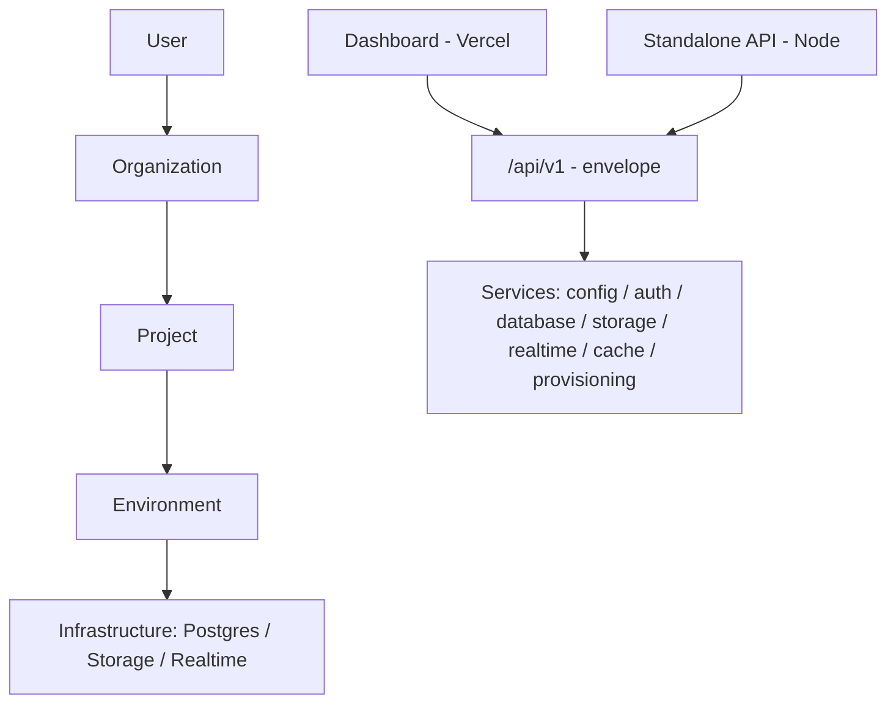
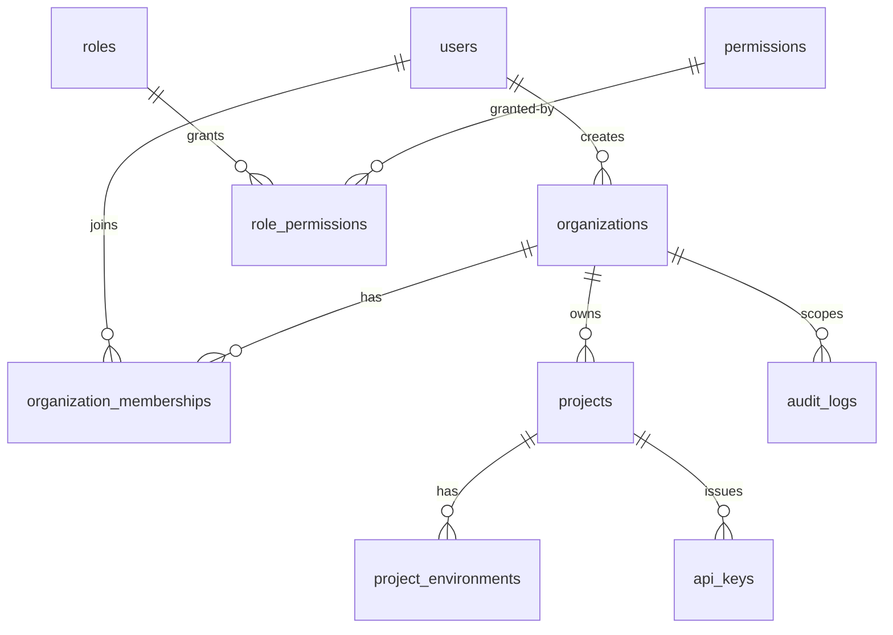
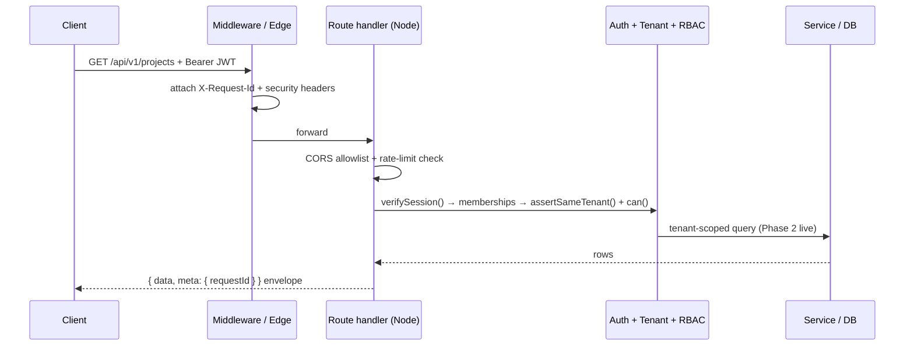

# cloudnivo.com

<div align="center">


<p>
  <a href="https://github.com/japhethsunday/cloudnivo.com"></a>
  
  
  
  
  
</p>

<p>
  <a href="https://github.com/japhethsunday/cloudnivo.com/stargazers"></a>
  <a href="https://github.com/japhethsunday/cloudnivo.com/network/members"></a>
  <a href="https://github.com/japhethsunday/cloudnivo.com/issues"></a>
  
  
  
</p>

<p>
  
  
  
  
</p>

<p>
  <strong>Developer-focused Backend-as-a-Service (Supabase-like) control-plane foundation.</strong><br />
  Production-quality monorepo, multi-tenant by design, $0 infra to start — Vercel-ready control plane, Docker-local data services, portable to any cloud without rewrites.
</p>

<p>
  <a href="#-quickstart"><strong>Quickstart</strong></a> ·
  <a href="#at-a-glance">At a glance</a> ·
  <a href="docs/architecture.md">Architecture</a> ·
  <a href="docs/api.md">API</a> ·
  <a href="docs/security.md">Security</a> ·
  <a href="docs/database.md">Database</a> ·
  <a href="docs/roadmap.md">Roadmap</a>
</p>

</div>

---

## Table of contents

- [Why CloudNivo](#why-cloudnivo)
- [At a glance](#at-a-glance)
- [Stack](#stack)
- [Quickstart](#-quickstart)
- [Verify](#verify)
- [Architecture](#architecture)
- [Data model](#data-model)
- [Request lifecycle](#request-lifecycle)
- [Layout](#layout)
- [Service catalog](#service-catalog)
- [API](#api)
- [Error catalog](#error-catalog)
- [Tenancy and security](#tenancy-and-security)
- [Testing](#testing)
- [Production build report](#production-build-report)
- [Scripts](#scripts)
- [Troubleshooting](#troubleshooting)
- [Roadmap](#roadmap)
- [Contributing](#contributing)
- [License](#license)

## Why CloudNivo

Every project gets isolated infrastructure per environment — Postgres, auth, storage, realtime, and versioned APIs — behind one coherent control plane:

| Capability                                            | Status (Phase 13)                                                   | Next                                  |
| ----------------------------------------------------- | ------------------------------------------------------------------- | ------------------------------------- |
| Organizations, projects, environments, API keys, RBAC | Live via API (memory default, Drizzle with `CONTROL_STORE=drizzle`) | Polish, quotas                        |
| Platform accounts + org invites                       | Done — signup/login/me, opaque invite tokens, Playwright smoke      | OAuth, password reset                 |
| Versioned REST envelope (`/api/v1`)                   | Done — control + data + storage + realtime + functions share it     | Stable (v2 only for breaking changes) |
| Per-table auto REST (`/:project/:table[/:id]`)        | Done — introspection-driven CRUD, keys, OpenAPI                     | RLS policies, nested resources        |
| Storage (buckets, objects, signed URLs)               | Done — streaming local driver + SigV4 S3 driver                     | Webhooks, multipart dashboard uploads |
| Realtime (WS, CDC, broadcast, presence)               | Done — gateway + LISTEN/NOTIFY CDC + memory/Redis bus               | Storage webhooks → realtime events    |
| Functions (deploy, invoke, versions, logs, env)       | Done — worker isolates + container runtime + console                | SDK data-plane access, CLI            |
| Provisioning (`Project → Infrastructure`)             | Done — Docker provider (+ container host mode)                      | Cloud drivers (Railway/VPS/K8s)       |
| Billing + usage metering                              | Done — plans, quotas, manual provider (no charges), webhooks        | Stripe provider, portals              |
| Agent access tokens (`cn_agent_*`)                    | Done — scopes, approval-gated destructives, activity, UI/CLI/SDK    | Fine-grained policies, audit export   |
| Dashboard                                             | Database, API, Auth, Storage, Realtime, Functions, Agents consoles  | Live data wiring polish               |

## At a glance

| Metric               | Value                                                  |
| -------------------- | ------------------------------------------------------ |
| Workspaces           | 13 (2 apps + 11 packages)                              |
| Test suite           | 140+ tests, all passing (3 Docker tests gated)         |
| API surface          | Control plane + generated per-table REST + OpenAPI     |
| Control-plane tables | 12 (`users` → `provisioning_jobs`, see Data model)     |
| RBAC                 | 4 roles, 14 permissions, strict hierarchy              |
| First Load JS        | 103 kB shared (see Production build report)            |
| Infra cost           | $0 — Docker-local Postgres/Redis, Vercel control plane |

## Stack

<p>
  
</p>

Next.js 15 · TypeScript · PostgreSQL 16 · Redis 7 · Drizzle ORM · Zod · Vitest · ESLint · Prettier · Docker Compose. Vercel hosts the control plane; Postgres/Redis run locally via Docker and migrate to managed cloud later without rewrites (every infra dependency sits behind an interface).

## <a id="-quickstart"></a>Quickstart

**Prerequisites:** Node >= 20, npm >= 10, Docker (for Postgres/Redis).

```bash
cp .env.example .env
npm install
docker compose up -d
npm run build:packages  # once — the dashboard bundles built workspace output
npm run dev        # dashboard → http://localhost:3000
npm run dev:api    # standalone API → http://localhost:3001
```

Windows PowerShell note: `cp` works in PowerShell via alias; alternatively use `Copy-Item .env.example .env`.

## Verify

```bash
npm run lint
npm run typecheck
npm test
npm run build
curl http://localhost:3001/api/v1/health
```

Expected health payload:

```json
{ "data": { "status": "ok", "version": "0.1.0" }, "meta": { "requestId": "..." } }
```

## Architecture



- **Control plane** (`apps/dashboard`, `packages/database`): users, orgs, memberships, projects, environments, keys, roles, audit logs. Source of truth for tenancy.
- **Data plane:** per-project Postgres, buckets, realtime gateways, functions. Phases 2–7 delivered provisioning, auto REST, customer auth, storage, realtime, and serverless functions against the same envelope; durable stores + CLI/SDKs next.
- Full decision log: [`docs/architecture.md`](docs/architecture.md).

## Data model



Authoritative DDL lives in [`packages/database/src/schema.ts`](packages/database/src/schema.ts); tenancy helpers in `tenant.ts`, role hierarchy in `rbac.ts`. Details: [`docs/database.md`](docs/database.md).

## Request lifecycle



## Layout

```text
apps/dashboard   Next.js control-plane UI + /api/v1/* BFF
apps/api         Framework-free Node API (same envelope)
packages/config, logging, validation, database, auth,
         storage, realtime, functions, cache, provisioning, api-core,
         api-engine
infrastructure/  Docker + Postgres bootstrap
docs/            architecture.md, security.md, database.md, api.md, realtime.md, functions.md, roadmap.md
tests/           Cross-package integration tests
```

- `apps/dashboard` — Next.js control-plane UI + `/api/v1/*` BFF
- `apps/api` — framework-free Node API (same envelope)
- `packages/{config,logging,validation,database,auth,storage,realtime,functions,cache,provisioning,api-core,api-engine}` — shared foundation
- `infrastructure/` — Docker + Postgres bootstrap
- `docs/` — `architecture.md`, `security.md`, `database.md`, `api.md`, `realtime.md`, `functions.md`, `roadmap.md`, `deploy-railway.md`
- `tests/` — cross-package integration tests

## Service catalog

| Package                                              | Interface                                    | Phase 1 driver                      | Future driver           |
| ---------------------------------------------------- | -------------------------------------------- | ----------------------------------- | ----------------------- |
| [`config`](packages/config/src/index.ts)             | `loadConfig()`                               | env + Zod fail-fast                 | managed secrets         |
| [`logging`](packages/logging/src/index.ts)           | `Logger`                                     | redacting JSON stdout               | log aggregator          |
| [`validation`](packages/validation/src/index.ts)     | shared Zod schemas                           | strict slugs/UUIDs                  | — (stable)              |
| [`database`](packages/database/src/service.ts)       | `DatabaseService`                            | `postgres` + Drizzle                | managed Postgres        |
| [`auth`](packages/auth/src/index.ts)                 | platform sessions + keys + customer plane    | scrypt + JWT + rotation + RLS       | OAuth, Magic Link       |
| [`storage`](packages/storage/src/index.ts)           | buckets, objects, signed URLs, quotas        | streaming local FS + SigV4 S3       | webhooks, multipart UI  |
| [`realtime`](packages/realtime/src/index.ts)         | `RealtimeService`                            | WS gateway + CDC + memory/Redis bus | storage webhooks        |
| [`functions`](packages/functions/src/index.ts)       | `FunctionService`                            | worker isolates + docker runtime    | SDK data-plane access   |
| [`cache`](packages/cache/src/index.ts)               | `CacheService`                               | memory (+ `ioredis` ready)          | Redis                   |
| [`provisioning`](packages/provisioning/src/index.ts) | `ProvisioningService`                        | Docker provider (+ host modes)      | Railway/VPS/K8s drivers |
| [`api-core`](packages/api-core/src/index.ts)         | envelope + guards                            | shared by both apps                 | — (stable)              |
| [`api-engine`](packages/api-engine/src/index.ts)     | introspection + CRUD engine + keys + OpenAPI | live Postgres via provider backends | RLS, nested resources   |
| [`automation`](packages/automation/src/index.ts)     | queues + schedules + webhooks service        | memory (Drizzle `automation_*`)     | durable time-series     |

## API

Base path: `/api/v1` — identical envelope in both runtimes.

```bash
curl http://localhost:3001/api/v1/health
curl -H "Authorization: Bearer <JWT>" http://localhost:3001/api/v1/projects
curl -H "apikey: cn_…" "http://localhost:3001/api/v1/projects/<id>/users?limit=20"
```

Control plane (Bearer session): orgs, projects, database lifecycle, connection,
SQL console, schema, metrics, jobs — see [`docs/api.md`](docs/api.md).

Data plane (session JWT, project `apikey`, or customer JWT): auto-generated per-table REST —
`GET/POST /:table`, `GET/PATCH/DELETE /:table/:id` with filter/sort/pagination,
plus per-project `keys` management and live `openapi.json`. Customer users get
owner-scoped rows automatically. Try it in the
dashboard: project page → **Open API console**.

Contract details: [`docs/api.md`](docs/api.md).

## Error catalog

| Code                               | Status | When                                              |
| ---------------------------------- | ------ | ------------------------------------------------- |
| `VALIDATION_ERROR` / `BAD_REQUEST` | 400    | Zod body/query failure, field-level details       |
| `MALFORMED_JSON`                   | 400    | Request body is not valid JSON                    |
| `UNAUTHORIZED` / `INVALID_KEY`     | 401    | Missing/invalid session, key, or expired key      |
| `FORBIDDEN` / `TENANT_FORBIDDEN`   | 403    | Cross-org/project access, wrong role, revoked key |
| `NOT_FOUND`                        | 404    | Unknown route, table, row, or job                 |
| `CONFLICT`                         | 409    | Slug/unique collisions                            |
| `PAYLOAD_TOO_LARGE`                | 413    | Body over 256 KB (data) / 1 MB (global)           |
| `RATE_LIMITED`                     | 429    | IP, per-key, or per-project budget exceeded       |
| `PROVISION_FAILED`                 | 502    | Infra op failed (detail logged, not returned)     |
| `INFRA_UNAVAILABLE`                | 503    | Docker unreachable — retry later                  |
| `INTERNAL`                         | 500    | Message redacted, `requestId` preserved           |

## Tenancy and security

`User → Organization → Project → Infrastructure`. Memberships are the only access grant; `assertSameTenant()` + `can(role, permission)` run server-side on every request. See `docs/security.md` and `docs/database.md`.

- [x] Bearer JWT sessions + project API keys (`public`/`service`, hash-only, expiring, revocable, usage-counted)
- [x] Customer auth per project (rotating refresh, verify/reset, metadata guards, owner-scoped data)
- [ ] DB-enforced RLS policies, KMS-encrypted credentials, OAuth/Magic Link, WS auth (later phases)
- [ ] KMS-encrypted credentials, OAuth/Magic Link, WS auth (later phases)
- [x] Zod at every boundary — client IDs/roles never trusted
- [x] Fail-closed CORS allowlist + IP, per-key, and per-project rate limiting
- [x] Allow-listed SQL identifiers + `$n` values only; bodies capped; secrets never in URLs
- [x] Redacting JSON logger (`requestId`, no secrets/PII)
- [x] `X-Request-Id` + HSTS / frame / CSP / referrer headers
- [x] Append-only org-scoped audit logs (incl. key + data-mutation events)
- [ ] Row-Level Security, KMS-encrypted credentials, OAuth, WS auth (later phases)

## Testing

| Command             | What it proves                                                                            |
| ------------------- | ----------------------------------------------------------------------------------------- |
| `npm run lint`      | ESLint flat config, zero warnings                                                         |
| `npm run typecheck` | `tsc --noEmit` across all 13 workspaces                                                   |
| `npm test`          | Vitest: storage E2E (real bytes) + engine/keys/auth suites + injection/isolation matrices |
| `npm run build`     | All packages `tsc` emit + `apps/api` + `next build`                                       |
| `DOCKER_TESTS=1`    | Real-Postgres integration (provision → CRUD → delete) where Docker exists                 |

## Production build report

Measured via `npm run build` (Next.js 15.5.25):

| Route (app)                                            | Size    | First Load JS |
| ------------------------------------------------------ | ------- | ------------- |
| `/`                                                    | 163 B   | 106 kB        |
| `/dashboard`                                           | 163 B   | 106 kB        |
| `/account`, `/organizations`, `/projects`, `/settings` | 137 B   | 103 kB        |
| `/api/v1/health`, `/api/v1/projects` (dynamic)         | 137 B   | 103 kB        |
| Shared First Load JS                                   | —       | 103 kB        |
| Middleware                                             | 34.5 kB | —             |

## Scripts

| Script                                          | Purpose                                    |
| ----------------------------------------------- | ------------------------------------------ |
| `npm run dev` / `dev:api`                       | Dashboard (:3000) / standalone API (:3001) |
| `npm run lint` / `typecheck` / `test` / `build` | Quality gates (run in this order)          |
| `npm run format` / `format:check`               | Prettier write / check                     |
| `npm run db:generate` / `db:migrate`            | Drizzle generate / migrate                 |

## Troubleshooting

| Symptom                               | Fix                                                                   |
| ------------------------------------- | --------------------------------------------------------------------- |
| `docker` not recognized               | Install Docker Desktop, then `docker compose up -d`                   |
| Port 3000/3001/5432 in use            | Free the port or override via `.env` (`API_PORT`, `POSTGRES_PORT`)    |
| `ConfigError: JWT_SECRET`             | Copy `.env.example` → `.env`, set 32+ char secret                     |
| DB unreachable                        | `docker compose ps`, check `DATABASE_URL` matches compose credentials |
| Native `swc` warning on Windows build | Harmless — Next falls back to wasm, build still succeeds              |

## Env

All config via `loadConfig()` (`packages/config`) — fails fast with `ConfigError` when secrets are missing. Never commit `.env`, `*.key`, `*.pem`. Start from [`.env.example`](.env.example).

## Roadmap

Phase 13 (this release): agent access tokens (`cn_agent_*`, scopes, approval-gated destructives, activity, dashboard/CLI/SDK — see `docs/agent-tokens.md`). Phase 12: billing + usage metering (plans, quotas, manual provider default). Phase 9: CLI/SDKs. Details: [`docs/roadmap.md`](docs/roadmap.md). Functions reference: [`docs/functions.md`](docs/functions.md). Deploy: [`docs/deploy-railway.md`](docs/deploy-railway.md).

## Star history

<a href="https://github.com/japhethsunday/cloudnivo.com/stargazers"></a>

## Contributing

```bash
git checkout -b feat/<scope>
npm run lint && npm run typecheck && npm test && npm run build
```

Keep PRs scoped, never commit secrets, and add a test for every boundary change (tenant, authz, validation, envelope).

## License

MIT — see `LICENSE` when added. Until then, all rights reserved to the CloudNivo authors.

<div align="center">

</div>
