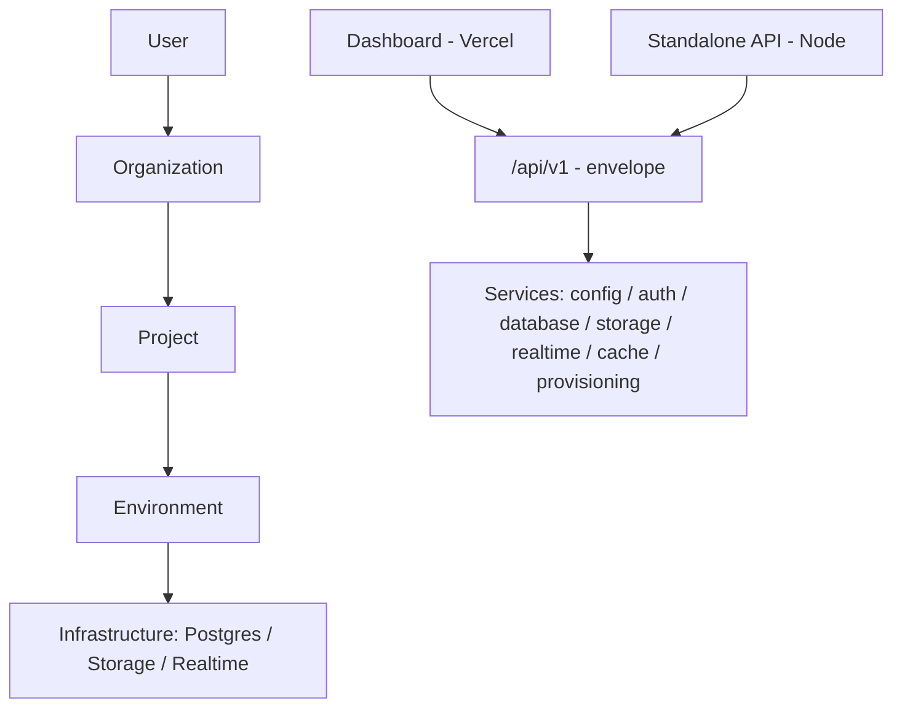

# cloudnivo.com

<div align="center">


<p>
  <a href="https://github.com/japhethsunday/cloudnivo.com"></a>
  
  
  
  
  
</p>

<p>
  <strong>Developer-focused Backend-as-a-Service (Supabase-like) control-plane foundation.</strong><br />
  Production-quality monorepo, multi-tenant by design, $0 infra to start — Vercel-ready control plane, Docker-local data services, portable to any cloud without rewrites.
</p>

<p>
  <a href="#-quickstart"><strong>Quickstart</strong></a> ·
  <a href="docs/architecture.md">Architecture</a> ·
  <a href="docs/api.md">API</a> ·
  <a href="docs/security.md">Security</a> ·
  <a href="docs/database.md">Database</a> ·
  <a href="docs/roadmap.md">Roadmap</a>
</p>

</div>

---

## Table of contents

- [Why CloudNivo](#why-cloudnivo)
- [Stack](#stack)
- [Quickstart](#-quickstart)
- [Verify](#verify)
- [Architecture](#architecture)
- [Layout](#layout)
- [API](#api)
- [Tenancy and security](#tenancy-and-security)
- [Testing](#testing)
- [Roadmap](#roadmap)
- [Contributing](#contributing)
- [License](#license)

## Why CloudNivo

Every project gets isolated infrastructure per environment — Postgres, auth, storage, realtime, and versioned APIs — behind one coherent control plane:

| Capability                                            | Phase 1 (this repo)                             | Where it lands                              |
| ----------------------------------------------------- | ----------------------------------------------- | ------------------------------------------- |
| Organizations, projects, environments, API keys, RBAC | Schema + service interfaces + guards            | Live persistence in Phase 2                 |
| Versioned REST envelope (`/api/v1`)                   | Done — shared by dashboard BFF + standalone API | Automatic per-project data APIs in Phase 3  |
| Storage / Realtime / Cache abstractions               | Done — local/memory drivers                     | S3-compatible + Redis/WS drivers in Phase 3 |
| Provisioning (`Project → Infrastructure`)             | Done — local planner                            | Cloud driver (Terraform/API) in Phase 4     |
| Dashboard shell                                       | Done — 5 routes, dark/light, responsive         | Live data wiring in Phase 2                 |

## Stack

<p>
  
</p>

Next.js 15 · TypeScript · PostgreSQL 16 · Redis 7 · Drizzle ORM · Zod · Vitest · ESLint · Prettier · Docker Compose. Vercel hosts the control plane; Postgres/Redis run locally via Docker and migrate to managed cloud later without rewrites (every infra dependency sits behind an interface).

## <a id="-quickstart"></a>Quickstart

**Prerequisites:** Node >= 20, npm >= 10, Docker (for Postgres/Redis).

```bash
cp .env.example .env
npm install
docker compose up -d
npm run dev        # dashboard → http://localhost:3000
npm run dev:api    # standalone API → http://localhost:3001
```

## Verify

```bash
npm run lint
npm run typecheck
npm test
npm run build
curl http://localhost:3001/api/v1/health
```

Expected health payload:

```json
{ "data": { "status": "ok", "version": "0.1.0" }, "meta": { "requestId": "..." } }
```

## Architecture



- **Control plane** (`apps/dashboard`, `packages/database`): users, orgs, memberships, projects, environments, keys, roles, audit logs. Source of truth for tenancy.
- **Data plane** (future): per-project Postgres, buckets, realtime gateways, functions. Phase 1 ships the interfaces + local drivers only.
- Full decision log: [`docs/architecture.md`](docs/architecture.md).

## Layout

```text
apps/dashboard   Next.js control-plane UI + /api/v1/* BFF
apps/api         Framework-free Node API (same envelope)
packages/config, logging, validation, database, auth,
         storage, realtime, cache, provisioning, api-core
infrastructure/  Docker + Postgres bootstrap
docs/            architecture.md, security.md, database.md, api.md, roadmap.md
tests/           Cross-package integration tests
```

- `apps/dashboard` — Next.js control-plane UI + `/api/v1/*` BFF
- `apps/api` — framework-free Node API (same envelope)
- `packages/{config,logging,validation,database,auth,storage,realtime,cache,provisioning,api-core}` — shared foundation
- `infrastructure/` — Docker + Postgres bootstrap
- `docs/` — `architecture.md`, `security.md`, `database.md`, `api.md`, `roadmap.md`
- `tests/` — cross-package integration tests

## API

Base path: `/api/v1` — identical envelope in both runtimes.

```bash
curl http://localhost:3001/api/v1/health
curl -H "Authorization: Bearer <JWT>" http://localhost:3001/api/v1/projects
```

| Method | Path               | Auth   | Notes                                      |
| ------ | ------------------ | ------ | ------------------------------------------ |
| `GET`  | `/api/v1/health`   | none   | Liveness + version envelope                |
| `GET`  | `/api/v1/projects` | Bearer | Tenant-scoped stub (DB listing in Phase 2) |
| `POST` | `/api/v1/projects` | Bearer | Validates `{ name, slug, organizationId }` |

Contract details: [`docs/api.md`](docs/api.md).

## Tenancy and security

`User → Organization → Project → Infrastructure`. Memberships are the only access grant; `assertSameTenant()` + `can(role, permission)` run server-side on every request. See `docs/security.md` and `docs/database.md`.

Highlights: Bearer JWT sessions + hash-only API keys (`cn_…` shown once), Zod at every boundary, fail-closed CORS allowlist, per-IP rate limiting (120/min default), redacting JSON logger with `requestId`, `X-Request-Id` + strict transport/frame/CSP headers, append-only org-scoped audit logs.

## Testing

| Command             | What it proves                                                                                                                          |
| ------------------- | --------------------------------------------------------------------------------------------------------------------------------------- |
| `npm run lint`      | ESLint flat config, zero warnings                                                                                                       |
| `npm run typecheck` | `tsc --noEmit` across all 12 workspaces                                                                                                 |
| `npm test`          | Vitest: 41 tests — tenant isolation, RBAC, auth, validation, envelopes, storage traversal, realtime channel auth, live HTTP 401/400/404 |
| `npm run build`     | All packages `tsc` emit + `apps/api` + `next build` (9 routes)                                                                          |

## Env

All config via `loadConfig()` (`packages/config`) — fails fast with `ConfigError` when secrets are missing. Never commit `.env`, `*.key`, `*.pem`. Start from [`.env.example`](.env.example).

## Roadmap

Phase 2: migrations + seed, real auth/org/project/key persistence, audit writes, live dashboard data, Playwright smoke. Phase 3: Redis realtime/WS + S3 storage + auto data APIs. Phase 4: cloud provisioning + functions + usage/CLI/SDKs. Details: [`docs/roadmap.md`](docs/roadmap.md).

## Contributing

```bash
git checkout -b feat/<scope>
npm run lint && npm run typecheck && npm test && npm run build
```

Keep PRs scoped, never commit secrets, and add a test for every boundary change (tenant, authz, validation, envelope).

## License

MIT — see `LICENSE` when added. Until then, all rights reserved to the CloudNivo authors.

<div align="center">

</div>
